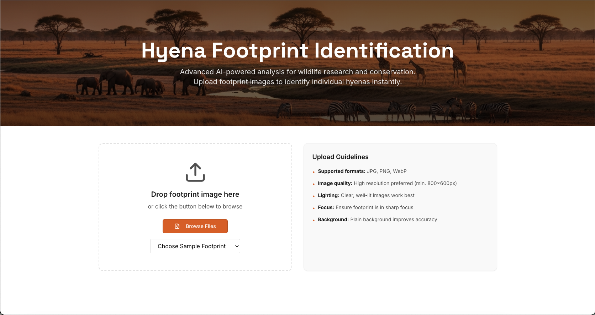
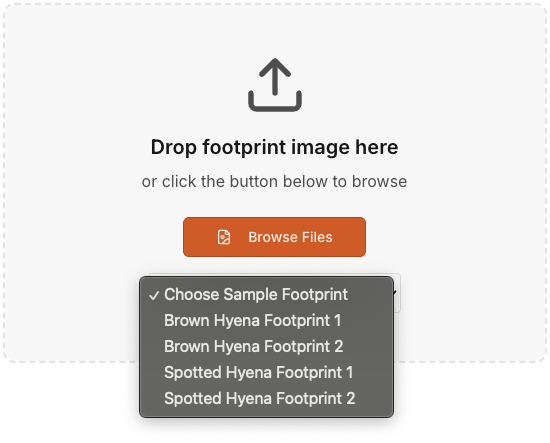
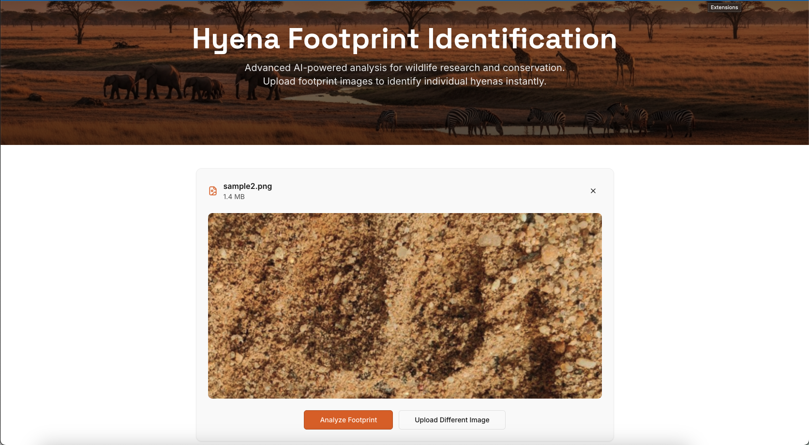
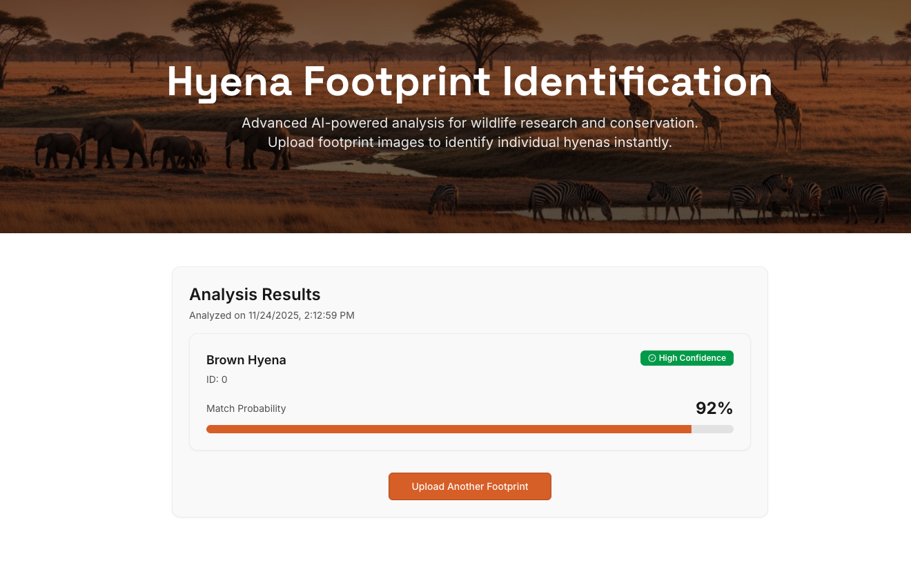

# Hyena Footprint Identification System

## Overview

In partnership with WildTrack (wildtrack.org), we have developed a hyena footprint identification system that allows users to match footprints they see in the wild to the species it belongs to.

Link: http://hyenaclassification.org/
Model: https://github.com/tylercaulfield/Hyena-Footprints/

## Project Architecture

### Frontend (React + TypeScript)
- **Hero Section**: Savanna landscape background with app title and description
    
- **Upload Interface**: Drag-and-drop zone with file browser option and select sample image option
    

- **Image Preview**: Shows uploaded image with metadata before analysis
- **Loading State**: Overlay with spinner during API processing
    
- **Results Display**: Shows identified hyenas with confidence percentages
    

### Backend (Express + Node.js)
- **File Upload**: Handles image uploads using Multer (10MB limit, images only)
- **API Proxy**: Forwards images to external footprint identification API
